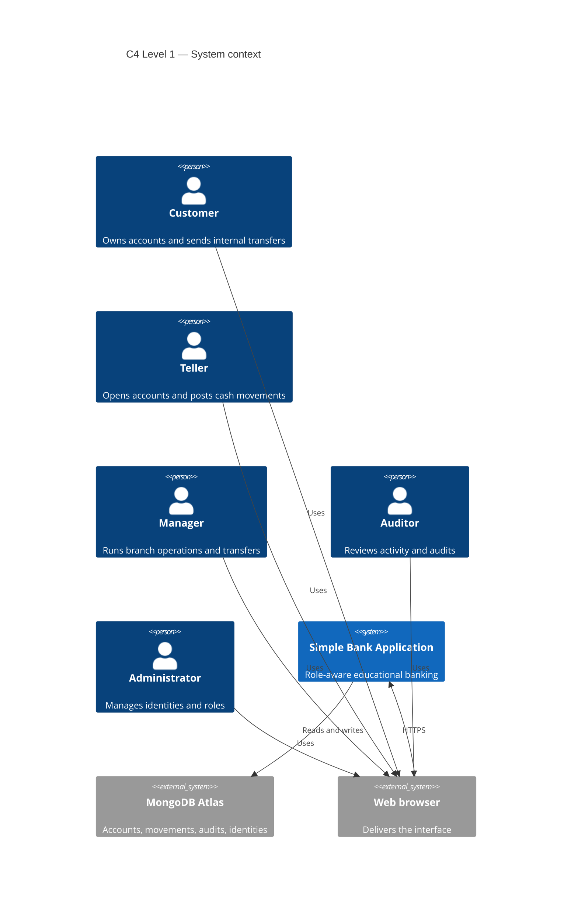
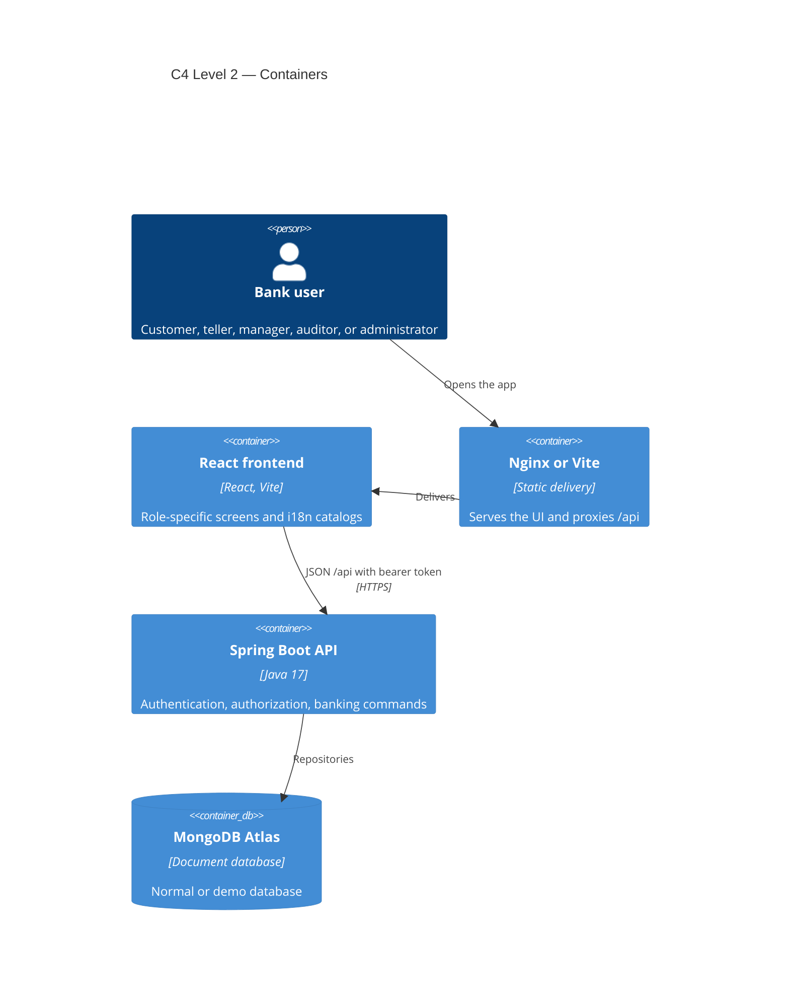
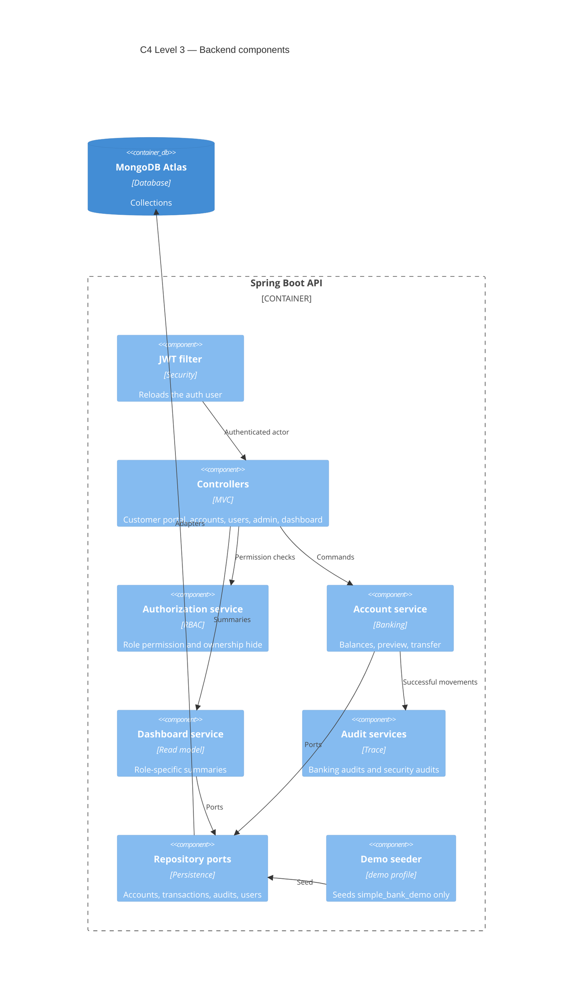
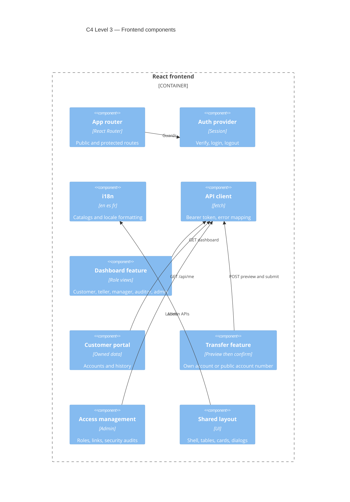
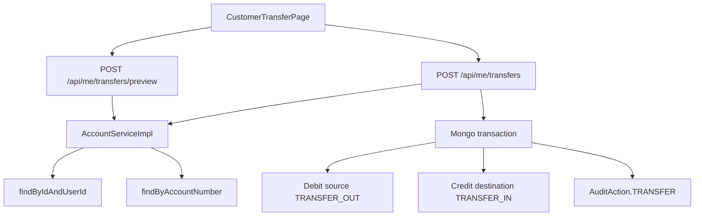

# C4 architecture

This document describes the educational Simple Bank application using the C4 model. Diagrams are Mermaid and render on GitHub.

The system is a role-aware banking demo. It is not a production bank and does not claim regulatory compliance.

## C4 Level 1 — System context

People use one application. MongoDB Atlas stores durable data. The browser is the delivery device, not a separate business system.

| Person | What they do |
| --- | --- |
| Customer | Views owned accounts and history, and sends an internal transfer from an owned account |
| Teller | Serves customers with deposits, withdrawals, and account opening. Cannot transfer |
| Manager | Operates the branch, including transfers between accounts by internal id, and reads banking audits |
| Auditor | Reads customers, accounts, history, premium accounts, and banking audits. Cannot change money |
| Administrator | Manages login identities, roles, customer links, and security audits |

The system boundary is the Simple Bank Application: the React client plus the Spring Boot API. Atlas is outside that boundary.

## C4 Level 2 — Containers

The browser loads the React application. In Docker, Nginx serves the built files and proxies `/api/` to Spring Boot. In local development, Vite serves the frontend and proxies `/api`. Spring Boot is the only component that talks to MongoDB.

The access token lives in `sessionStorage` under `simple-bank-access-token`. Language preference lives in `localStorage` and is independent of the token. English, Spanish, and French catalogs ship with the frontend. The API does not translate its error messages.

Normal mode uses the configured application database. Demo mode uses the `demo` Spring profile and the isolated `simple_bank_demo` database. Demo seeding refuses any other database name.

## C4 Level 3 — Backend components

Spring Security authenticates the request. The JWT filter is constructed inside the security filter chain and reloads the auth user. Controllers do not read MongoDB directly. They call services. Services call repository ports. Mongo adapters implement those ports.

Role is decided by `RolePermissions` and enforced by `BankAuthorizationService.require`. Ownership of a customer resource is decided in the account and user services with `findByIdAndUserId`. A hidden foreign resource becomes `ResourceNotFoundException` (404). A role that lacks the action becomes `AccessDeniedException` (403).

Money movement that must stay consistent uses a Mongo transaction on the service method: debit, credit, history, and audit commit together or roll back together. Customer internal transfers do this in `submitCustomerTransfer`. Audit rows are written by the audit repository from the account service, not from the controller.

## C4 Level 3 — Frontend components

The router and providers wrap authentication, language, and toasts. Protected routes read the verified role from `GET /api/auth/verify`. The client does not decode the JWT to decide a role.

The dashboard feature renders a different view per primary role. The customer portal owns accounts, history, and the transfer preview flow. Shared layout components keep tables and cards responsive. The API client attaches the session token and never sends a role in the body.

## C4 Level 4 — Internal transfer code

A customer transfer is a command, not a read of someone else's account. Source lookup requires the authenticated customer's bank user id. Destination lookup uses only the public account number inside preview and submit.

See [transfer-flow.md](transfer-flow.md) for the sequence, privacy choice, and validation rules.
