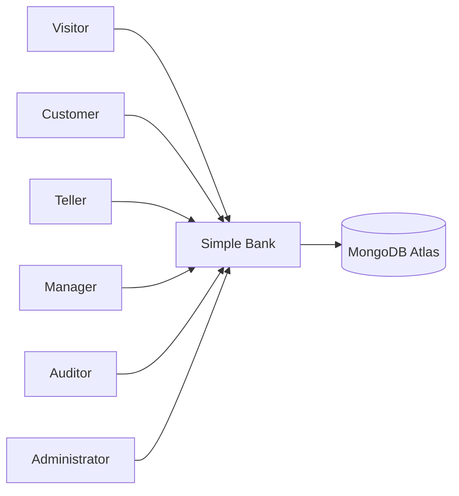

# 01. System context

This is the furthest zoom. The box in the middle is the whole Simple Bank program. Everything else is a person or an outside system.

## What this shows

Six kinds of people use one software system. The only system outside Simple Bank is MongoDB Atlas, the hosted database.

## How it works

A visitor opens the public landing page and can register or sign in. After sign-in, the person is one of five roles. The role decides which screens and which API calls succeed. Every saved customer, account, transaction, login, and audit row is stored in Atlas.

## Why it is built this way

The classroom system is one application with a clear outside dependency. Atlas is separate so the API can restart without losing data, and so the demo database can be isolated from normal data.

## Technical concept

In C4, the context diagram names the system and its neighbors. It does not name classes.

These neighbors are intentionally absent:

| Idea | Status here |
| --- | --- |
| Basic Auth | Not implemented. It would send the password on later requests. |
| OAuth 2.0 / OpenID Connect | Not implemented. An identity provider would log the person in. |
| Email, cards, or a payment network | Not implemented. |

JWT is the login mechanism that is implemented. The comparison is explained in [security and identity](05-security-and-identity.md).
