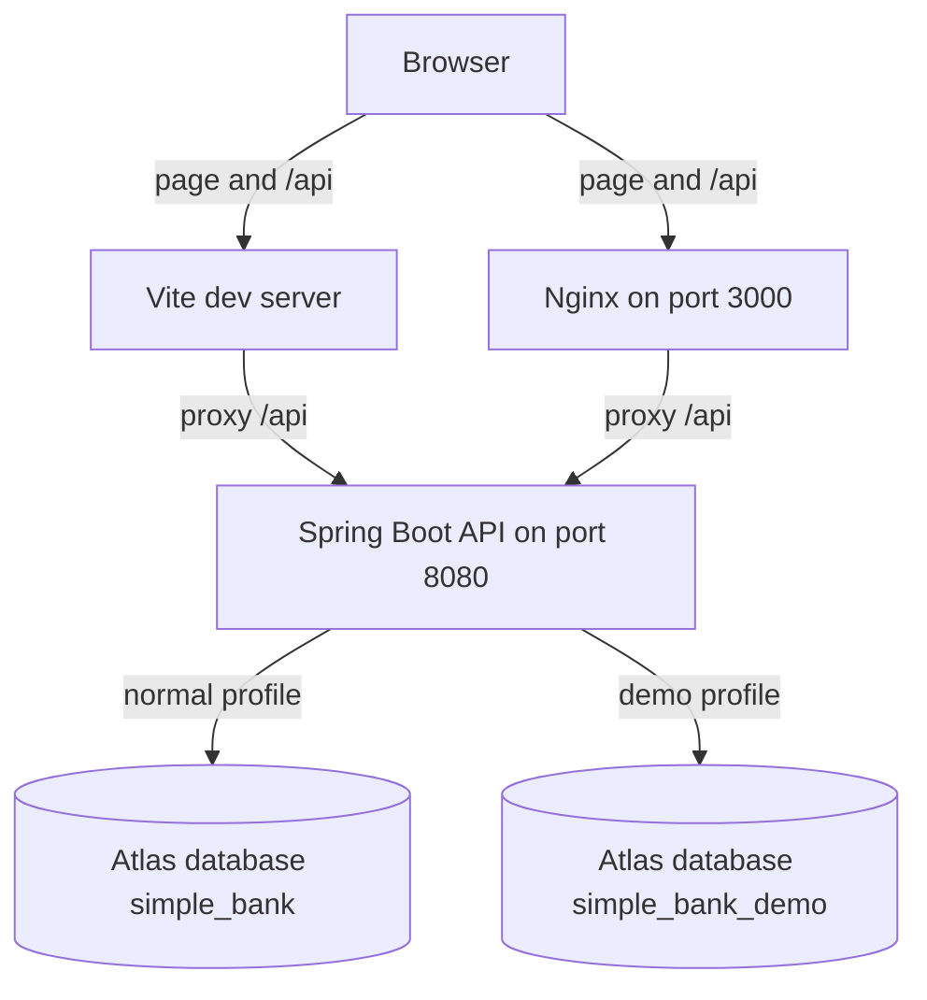

# 02. Containers

A container in C4 is a part you can run or deploy. It is not a Docker container only, although Docker is how this project runs the two applications together.

## What this shows

The person uses one origin in the browser. Locally that origin is the Vite server. In Docker it is Nginx. Both forward `/api` to Spring Boot. Spring Boot talks to one Atlas database at a time.

## How it works

React calls a relative path such as `/api/users`. The browser therefore treats the call as same-origin. Vite, in `frontend/vite.config.ts`, proxies `/api` to `localhost:8080`. Nginx, in `frontend/nginx.conf`, proxies `/api` to the backend container. The API never needs `@CrossOrigin("*")`.

`docker-compose.yml` starts the normal API against `simple_bank`. Adding `docker-compose.demo.yml` sets the `demo` profile and `MONGODB_DATABASE=simple_bank_demo`.

## Why it is built this way

A browser page on port 3000 calling port 8080 directly would be a cross-origin request. The proxy removes that problem and keeps the MongoDB URI and the JWT signing secret on the server.

## Technical concept

CORS is a browser rule: a page may not read a response from another origin unless that server allows it. Same-origin `/api` means the browser never makes that cross-origin call.

The two databases are two names in Atlas, not two products. Demo users exist only in `simple_bank_demo`.
