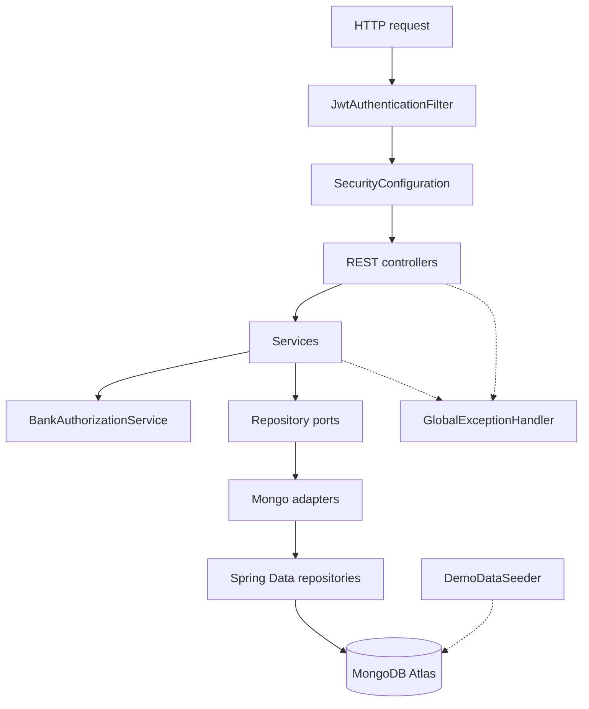

# 03. Backend components

This is the inside of the Spring Boot container. A component is a group of classes with one job.

## What this shows

A request is checked, then handled, then saved. The dashed arrows are failures and the demo seeder. They are not on the happy path of every request.

## How it works

`SecurityConfiguration` permits `POST /api/auth/register`, `POST /api/auth/login`, and `GET /api/public/config`. Every other `/api/**` path requires authentication. `JwtAuthenticationFilter` reads `Authorization: Bearer`, checks the signature and expiry, reloads the `AuthUser`, and only then allows the controller to run.

Controllers on this branch:

| Controller | Path | Job |
| --- | --- | --- |
| `AuthController` | `/api/auth` | Register, login, verify |
| `UserController` | `/api/users` | Customer CRUD, name search, accounts of a customer |
| `AccountController` | `/api/accounts` | Accounts, deposit, withdraw, transfer, premium, history |
| `AuditController` | `/api/audits` | Banking audit read |
| `CustomerPortalController` | `/api/me` | The signed-in customer's own profile, accounts, and transfer |
| `AdminController` | `/api/admin/whoami` | Proof of an admin token |
| `AdminAccessController` | `/api/admin` | Roles, enablement, customer link, security audits |
| `DashboardController` | `/api/dashboard` | One role-specific summary |
| `PublicConfigController` | `/api/public/config` | Public demo flag for the landing page |

The service asks `BankAuthorizationService` whether this actor may do the operation. The repository port, such as `UserRepository`, is what the service calls. `MongoUserRepositoryAdapter` implements that port with Spring Data. The controller does not receive a Mongo template.

`GlobalExceptionHandler` turns failures into 400, 401, 403, 404, and 409 bodies. Those bodies include a stable `code` and do not include a stack trace.

`DemoDataSeeder` runs only when the `demo` profile is on and seeding is enabled. It writes `simple_bank_demo` and refuses any other database name.

## Why it is built this way

Each layer can be tested alone. A service test can use a fake repository. A controller test can stop at HTTP. Swapping the database would change the adapter, not the banking rules.

## Technical concept

This is a ports-and-adapters split. The port is the Java interface (`UserRepository`). The adapter is the Mongo class. Spring Data is the library that turns a method name such as `findByNameStartingWithIgnoreCase` into a query.

Collections used by the adapters:

| Collection | Contents |
| --- | --- |
| `users` | Bank customers: name, email |
| `accounts` | Accounts owned by a user id |
| `transactions` | DEPOSIT or WITHDRAW rows |
| `audits` | Banking actions such as deposit, withdraw, and transfer |
| `auth_users` | Logins: username, BCrypt hash, role, optional `bankUserId` |
| `security_audits` | Role changes, enablement, links, bootstrap |
| `demo_seed_metadata` | Marker that the demo dataset finished |

`users` and `auth_users` are different records. Registration creates a login. It does not create a bank customer.
