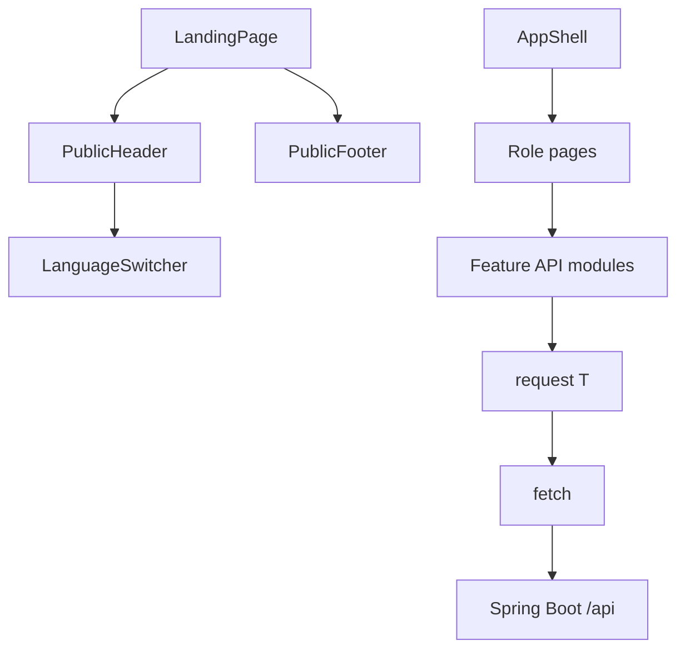

# 04. Frontend components

This is the inside of the React container. The public page and the signed-in application are two parents.

## What this shows

`LandingPage` is the parent of `PublicHeader` and `PublicFooter`. Signed-in screens render inside `AppShell`. Both sides eventually call the same HTTP helper.

## How it works

`LandingPage` passes `isAuthenticated` into `PublicHeader`. The header chooses Sign in (`/login`) or Open app (`/app`). It also passes `credentialsUrl` and `repositoryUrl` into `PublicFooter`. That is props: data flowing down.

`PublicHeader` owns the open or closed state of the mobile menu. `ConfirmDialog` does not delete a customer itself. It calls `onConfirm`, which the parent supplied. `ErrorState` calls `onRetry`. That is a callback: an event flowing up.

Feature clients:

| Module | Calls |
| --- | --- |
| `authApi` | `/api/auth/register`, `/api/auth/login`, `/api/auth/verify` |
| `usersApi` | `/api/users` and related staff customer routes |
| `accountsApi` | `/api/accounts`, money movement, premium, history |
| `meApi` | `/api/me` and the customer portal |
| `adminApi` | `/api/admin/auth-users` and security audits |
| `dashboardApi` | `GET /api/dashboard` |

Each function calls `request<T>()` in `frontend/src/shared/api/client.ts`. That helper calls `fetch`, attaches the Bearer token from `sessionStorage`, and throws `ApiError` on failure. Screens then use `getErrorMessage`.

| UI state | Component | Meaning |
| --- | --- | --- |
| Waiting | `PageLoading` | Skeleton while the request is in flight |
| Failure | `ErrorState` | Message plus retry. No stack trace |
| Success with nothing | `EmptyState` | The server returned 200 and an empty list |

TanStack Table renders the dense staff tables, such as customers. Recharts renders the money charts on the customer and manager dashboards. Those charts load with the dashboard route.

## Why it is built this way

One shared `request()` keeps tokens, errors, and JSON parsing in one place. Feature modules keep endpoint knowledge next to the screen that uses it. A single `DataService` class that knew every URL would have to change for every new screen.

## Technical concept

Props are inputs a parent gives a child. State is data a component remembers between renders. The access token is not React state alone: `AuthProvider` also writes `sessionStorage` key `simple-bank-access-token`, so a refresh in the same tab can verify the session. The password is never stored. Language uses `localStorage` key `simple-bank-language`, so it survives logout.

Route guards in `frontend/src/app/router.tsx` hide screens the role should not open. The API still enforces the same rule. A hidden menu is not authorization.
