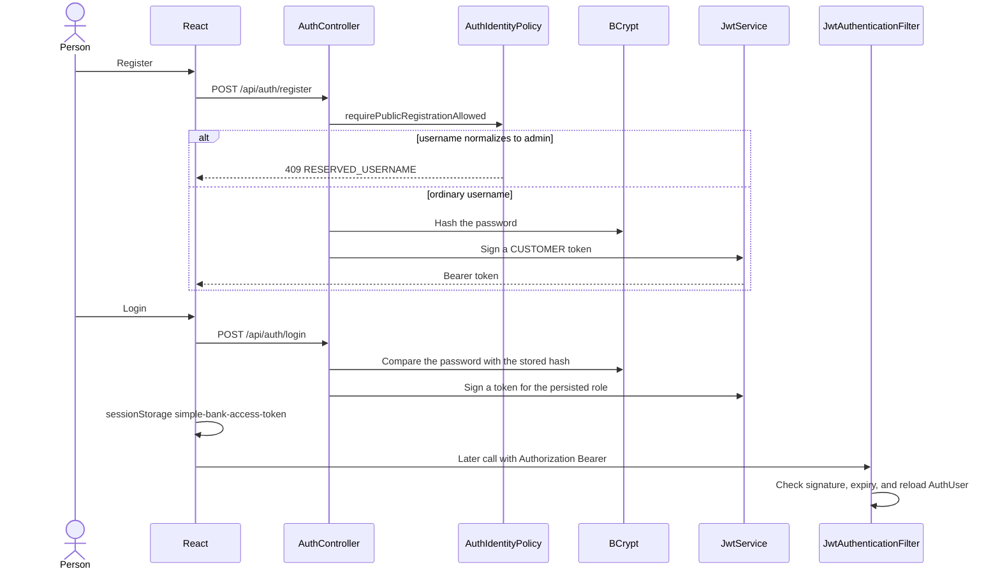
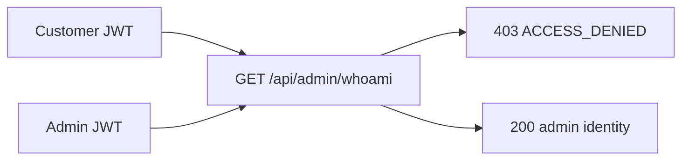

# 05. Security and identity

Authentication answers who is calling. Authorization answers what that caller may do. Both happen on the server.

## What this shows

Registration and login are the only calls that accept a password. Later calls send the token. The filter rejects a bad token before a controller runs.

## How it works

`AuthIdentityNormalizer` trims the username and lowercases it. `AuthIdentityPolicy` then treats `admin`, `Admin`, `ADMIN`, and ` admin ` as the same reserved name. Public registration cannot create it. If an `AuthUser` with that username already exists, `AdminAuthUserService.changeRole` refuses any role other than ADMIN with 409 `RESERVED_USERNAME`. Other staff names, such as `ava.admin`, are ordinary usernames. The project does not ship a password for a built-in `admin` account.

`AuthServiceImpl.login` checks the password through Spring Security. The stored value is a BCrypt hash. The JSON response contains `token` and `tokenType: Bearer`. It does not contain the password or the hash.

`JwtService` signs every token the same way. A customer token carries `ROLE_CUSTOMER`. An admin token carries `ROLE_ADMIN`. There are not two token classes.

On the next request the filter checks the signature with `JWT_SECRET` and the expiration. It then loads the current `AuthUser`. A disabled user or a changed role applies on the next call even if the old token still has time left. The React app does not trust decoded claims as its permission source. It calls `GET /api/auth/verify`.

The last enabled administrator cannot be disabled or moved off ADMIN. That check is separate from the reserved username. It applies to a normal admin login such as `ava.admin` when that person is the only enabled administrator.

## Why it is built this way

The password should cross the network once. After that, the server can recognize the caller without storing a session. Reloading `AuthUser` on each request means a role change is not stuck inside an old token until expiry.

## Technical concept

| Term | Meaning in this project |
| --- | --- |
| Authentication | Login succeeded and a JWT was issued |
| Authorization | `RolePermissions` and `BankAuthorizationService` allow or refuse the action |
| Hashing | BCrypt is one way. Login can check a password. It cannot recover the password |
| Encryption | Reversible with a key. Passwords here are not encrypted |
| JWT claims | Statements inside the token: subject, roles, expiration |
| Signature | Proves the token was not edited. A forged role fails verification |
| 401 | Missing token, bad token, or bad password |
| 403 | Known caller, action not allowed, such as customer to `/api/admin/whoami` |
| 404 | Missing, or hidden because it is not this customer's object |
| 409 | Conflict: reserved username, duplicate email, last administrator |

Basic Auth would attach the username and password to requests. It is not implemented. OAuth would delegate login to another company's identity provider. It is not implemented. JWT is the implemented step between those two ideas: one signed token after a local login.

The permission set for each role is listed in [customer and staff access](07-customer-and-staff-access.md).
