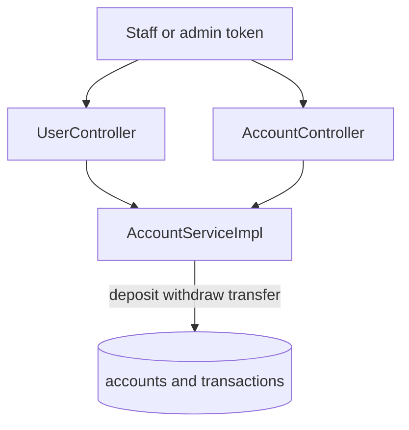
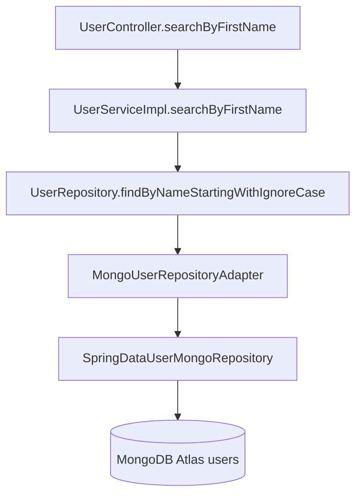

# 06. Banking ledger

This page is the money and customer data. Amounts are `BigDecimal` in Java and Decimal128 in MongoDB, with two decimal places.

## What this shows

Customer records and account records enter through controllers. Balance changes happen in `AccountServiceImpl`, inside a MongoDB transaction.

## How it works

Customer CRUD, all under `/api/users`:

| Action | Method and path | Who |
| --- | --- | --- |
| Create | `POST /api/users` | TELLER, MANAGER, ADMIN |
| List | `GET /api/users` | TELLER, MANAGER, AUDITOR, ADMIN |
| Read one | `GET /api/users/{id}` | Those roles, and a customer only for the linked self |
| Update | `PUT /api/users/{id}` | MANAGER, ADMIN. A customer updates self with `PUT /api/me/profile` |
| Delete | `DELETE /api/users/{id}` | MANAGER, ADMIN, and only when the customer has no accounts |
| Accounts of a customer | `GET /api/users/{id}/accounts` | Staff and admin |

Search is `GET /api/users/search?firstName=`. The customer document has one `name` field, not separate first and last names. The query is a case-insensitive prefix: `firstName=josvier` matches `Josvier Rodriguez`. No match is HTTP 200 and `[]`. A blank value is 400. A customer token is 403.

Premium accounts already exist as `GET /api/accounts/premium?threshold=`. MANAGER, AUDITOR, and ADMIN may read them. The threshold is a minimum balance.

Deposit is `POST /api/accounts/{id}/deposit`. Withdraw is `POST /api/accounts/{id}/withdraw`. Each method is `@Transactional`. It updates the balance and inserts one `transactions` row of type `DEPOSIT` or `WITHDRAW`. A failed amount check does not insert a row.

Staff transfer is `POST /api/accounts/transfer`. The customer portal uses `POST /api/me/transfers`. The account transfer route also accepts a customer token, and the service still requires both accounts to belong to that customer. `TransactionType` on this branch contains only `DEPOSIT` and `WITHDRAW`. A transfer saves one WITHDRAW on the source account and one DEPOSIT on the destination account, plus a banking audit whose action is TRANSFER. Those writes share one MongoDB transaction. The source and destination cannot be the same account. The source must have enough balance.

A customer may transfer only between accounts that person owns. Asking for another customer's account id returns 404. A teller can deposit and withdraw and cannot transfer. A manager or admin can transfer between accounts by id.

An empty transaction list, an empty search, and a customer with no accounts are successful empty lists. The React screen uses `EmptyState`, not `ErrorState`.

## Why it is built this way

If the balance changed and the history insert failed, the books would not match. The transaction makes those writes succeed or fail together. Decimal128 avoids the cents errors of binary floating point.

Search stays a prefix on `name` so the classroom example exists without splitting the customer model into first and last name.

## Technical concept

The code-level path for search is the place to see every layer on one request:

`UserController` only reads the query parameter and the HTTP role annotation. `UserServiceImpl` trims the text, rejects a blank value, checks `CUSTOMER_ANY_READ`, and calls the repository. The repository does not load every customer and filter in memory. Spring Data builds the prefix query.

A MongoDB transaction here means the deposit or withdraw or transfer is one atomic unit of work. Atomic means the reader does not see half of the transfer.
