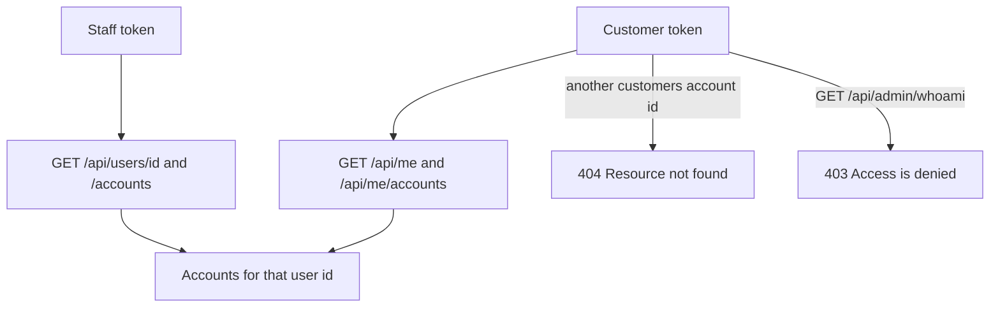

# 07. Customer and staff access

The same bank customer can be opened two ways. Staff look up an id. A customer does not choose another person's id.

## What this shows

Staff customer lookup and the customer portal are different doors onto the same `users` and `accounts` collections. The portal door only opens the row linked to the login.

## How it works

An `AuthUser` may store `bankUserId`. That field points at one document in `users`. Public registration does not set it. An administrator sets it from access management. Until then, `GET /api/me` returns 200 with the login and `bankUserLinked: false`. `GET /api/me/accounts` then refuses the call because there is no bank profile yet.

When the link exists, `CustomerPortalController` uses that id. The customer does not pass another customer's id. Account reads for a customer go through `findByIdAndUserId(accountId, bankUserId)`. If that pair does not exist, the response is 404 `Resource not found`. The body does not say whether the account exists for someone else. A customer can still send money to another person by that person's public 12-digit account number. The preview shows a masked number and a short name, not the Mongo id, balance, or history.

Staff with `CUSTOMER_ANY_READ` may call `GET /api/users/{id}` and `GET /api/users/{id}/accounts` for any customer.

`RolePermissions.forRole` is the matrix. `USER` is a legacy stored value and is treated as CUSTOMER before this lookup. ADMIN receives every permission.

| Permission | CUSTOMER | TELLER | MANAGER | AUDITOR | ADMIN |
| --- | --- | --- | --- | --- | --- |
| Read any customer | | yes | yes | yes | yes |
| Read own customer | yes | | | | yes |
| Create customer | | yes | yes | | yes |
| Update any customer | | | yes | | yes |
| Update own profile | yes | | | | yes |
| Delete customer | | | yes | | yes |
| Read any account | | yes | yes | yes | yes |
| Read own account | yes | | | | yes |
| Create or update account | | create | yes | | yes |
| Delete account | | | yes | | yes |
| Deposit and withdraw | | yes | yes | | yes |
| Transfer own accounts | yes | | | | yes |
| Transfer any accounts | | | yes | | yes |
| Premium accounts and banking audits | | | yes | yes | yes |
| Manage logins | | | | | yes |

Tellers do not receive `TRANSFER_ANY` or `TRANSFER_SELF`. Auditors are read-only: they can search customers, read accounts, read premium accounts, and read audits. They cannot deposit, withdraw, transfer, or delete.

UI routes under `/app` hide screens, but a direct API call is decided by this table and by ownership checks.

## Why it is built this way

Returning 403 for a foreign account would tell the caller that the id exists. Returning 404 answers the ownership question and the missing-id question the same way. Returning 403 for `/api/admin/whoami` is different: the caller is authenticated, and the role is simply not allowed to use that operation.

## Technical concept

RBAC picks the permission set from the role. Object ownership is the second check: even a customer who may read accounts may read only the linked customer's accounts. IDOR is the attack of editing the id in the URL. `findByIdAndUserId` closes that hole for customer reads.

The login record and the bank customer stay separate so a person can have an API identity before anyone creates their bank profile, and so disabling a login does not delete the accounts.
