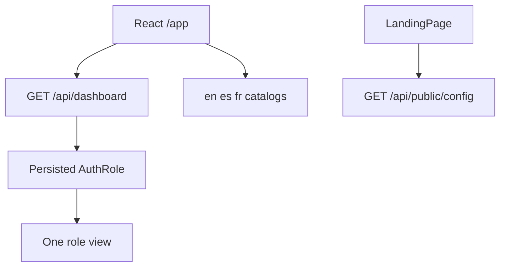

# 08. Dashboards, languages, demo data, and Docker

These four parts sit on top of the same API. They do not add a second security model.



## What this shows

The dashboard request has no `role` query parameter. The server reads the caller and returns one shape. The landing page can ask whether demo mode is on without a token.

## How it works

`DashboardController` requires an authenticated user and calls `DashboardService.getDashboard()`. `BankAuthorizationService.currentActor()` and `RolePermissions.effectiveRole` choose CUSTOMER, TELLER, MANAGER, AUDITOR, or ADMIN. Each branch aggregates on the server with `BigDecimal` and returns a small DTO. React maps that DTO to one view. Customer and manager views include Recharts series. Field-by-field sources are in [dashboard design](../dashboard-design.md).

The customer dashboard starts from `accounts.findByUserId` for the linked bank user. It does not download every account in the bank.

Language catalogs live in `frontend/src/shared/i18n/locales/{en,es,fr}`. The selected language is `localStorage` key `simple-bank-language`. Backend messages stay in the language the API returns. The UI maps `ErrorResponse.code` through `getErrorMessage`. `RESERVED_USERNAME` is one of those codes: "This username is reserved." in English, with Spanish and French entries beside it.

Demo startup is:

```text
docker compose -f docker-compose.yml -f docker-compose.demo.yml up --build
```

That sets the `demo` profile, `MONGODB_DATABASE=simple_bank_demo`, and `DEMO_SEED_RESET=false`. `DemoDataSeeder` checks the database name before it writes. If the dataset is already complete, it verifies it and does not insert another copy. Credentials for those synthetic users are only in `docs/demo-credentials.txt`.

Normal startup is `docker compose up --build` and uses `simple_bank` without seeding those demo users.

## Why it is built this way

Calculating totals in the browser required many calls and could show another role's data if the client asked for the wrong list. One server snapshot keeps the math next to the authorization check.

Seeding only the demo database means a classroom reset cannot wipe the normal database. Leaving `DEMO_SEED_RESET` false in the committed file means a normal restart does not drop the demo data either.

## Technical concept

i18n is internationalization: the same screen, three catalogs, one active language. The code of an error is stable (`RESERVED_USERNAME`). The sentence is translated.

A Spring profile is a named set of configuration. `demo` turns the seeder on. It does not turn off JWT or ownership.

Docker Compose runs the API container and the Nginx container on one network. The browser still sees one origin, as drawn in [containers](02-containers.md).
