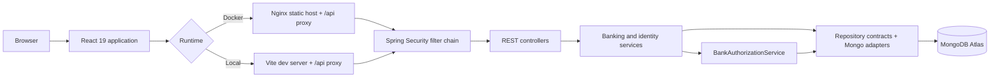
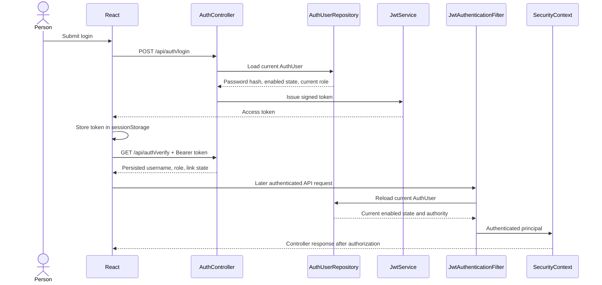
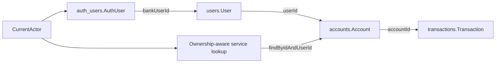
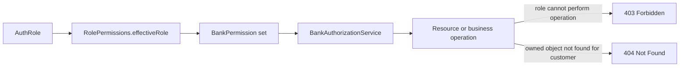
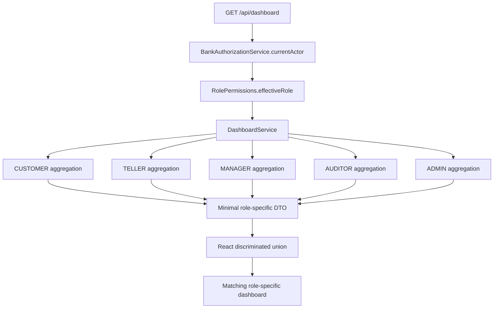
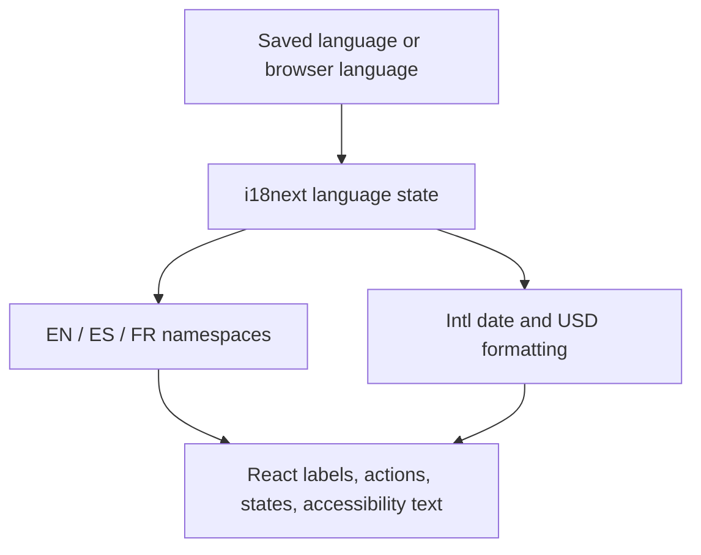
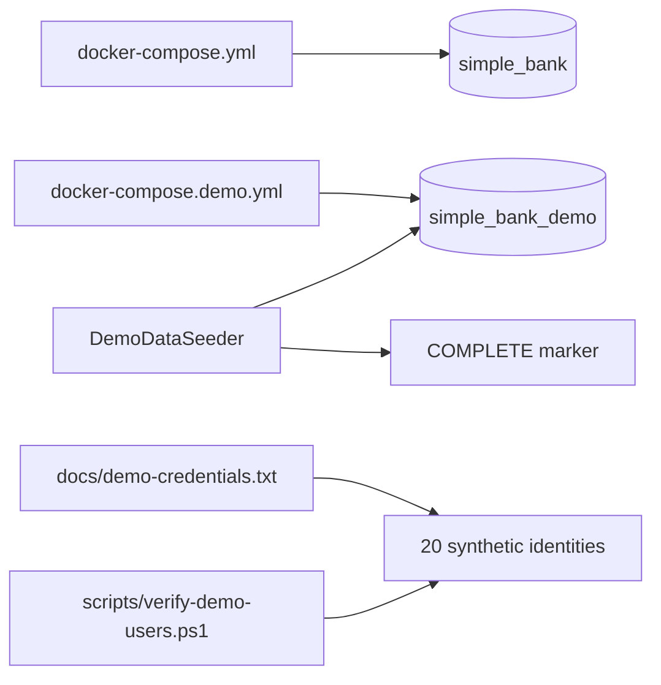

# Simple Bank System Architecture

Simple Bank is an educational banking application. It demonstrates authenticated banking workflows, customer ownership, staff role-based access, audit trails, localized React experiences, and isolated demo data. It is not a production bank and does not claim regulatory certification, deposit insurance, PCI compliance, fraud detection, or KYC/AML controls.

## System flow



| Layer | Responsibility |
| --- | --- |
| Browser | Holds the selected language and the current session token; renders accessible UI. |
| React | Routes, role-specific presentation, form validation, API calls, responsive layouts, and localization. |
| Nginx / Vite | Serves frontend assets and forwards same-origin `/api` requests to Spring Boot. |
| Spring Security | Requires authentication for `/api/**`, validates JWTs, and creates the security context. |
| Controllers | Define HTTP contracts and method-level authorization without implementing business rules. |
| Services | Enforce banking rules, ownership, access decisions, aggregation, and transactional behavior. |
| Authorization | Resolves the current persisted identity and evaluates effective permissions. |
| Repositories | Keep persistence details behind domain contracts and execute targeted MongoDB queries. |
| MongoDB Atlas | Stores identities, bank customers, accounts, transactions, and two separate audit trails. |

The frontend calls relative `/api` paths. The browser never receives the MongoDB URI or JWT signing secret.

## Authentication flow



The JWT proves that the token was issued by the application, but role claims in the token are not the final authority. The filter reloads the persisted `AuthUser` on every request. Disabling a user or changing a role therefore takes effect on the next request. The frontend also verifies the session rather than decoding claims as an authorization source. A failed post-login verification clears the partial `sessionStorage` token and rethrows the original error.

## Customer ownership flow



An API login and a bank customer are deliberately separate records. Public registration creates a `CUSTOMER` login; it does not create or infer a bank customer. An administrator explicitly creates or removes the `bankUserId` link.

Customer account reads use `findByIdAndUserId(accountId, bankUserId)`. This combines the object identifier and authenticated owner in the persistence lookup, so a customer cannot distinguish another customer’s account from a nonexistent account. Customer dashboard aggregation begins with `accounts.findByUserId(currentActor.bankUserId)` and requests transactions only for those account IDs.

## RBAC and resource decisions



`USER` exists only for legacy records and resolves to `CUSTOMER`. `BankAuthorizationService` centralizes current-actor, permission, and ownership checks. A `403` means the authenticated role cannot use the operation. A `404` hides the existence and ownership of an object that is outside a customer’s scope. UI route guards improve navigation, but the backend remains authoritative.

## Dashboard request flow



There is no role query parameter. The server derives the role from the authenticated, persisted actor and returns exactly one role-specific response. This replaces the former React multi-fetch approach, which downloaded broad collections and calculated totals in the browser. The new endpoint provides one consistent snapshot, keeps `BigDecimal` aggregation on the backend, reduces request waterfalls, and makes data minimization testable.

### Dashboard data sources

| Dashboard field | Source repository or collection | Role | Why it is shown |
| --- | --- | --- | --- |
| Total balance | Owned accounts via `AccountRepository.findByUserId` | Customer | Immediate personal financial position. |
| Account summaries | Owned accounts | Customer | Direct navigation to the customer’s own products. |
| 30-day deposits / withdrawals | Transactions filtered by owned account IDs and time | Customer | Personal money movement without global bank data. |
| Recent transactions | Same owned, time-bounded transaction query | Customer | Recent personal activity. |
| Customer / account directory counts | `UserRepository.count`, `AccountRepository.count` | Teller | Context for service lookup. |
| New accounts today | `AccountRepository.countByCreatedAtBetween` | Teller | Current-day service context. |
| My operation totals and history | Banking audits filtered by `actorAuthUserId` and time | Teller | Shows only the signed-in operator’s work. |
| Bank balance and account mix | `AccountRepository.findAll` | Manager | Operational money position and product mix. |
| Premium account count | Account balances aggregated with the documented threshold | Manager | Identifies higher-balance account volume. |
| 30-day money movement | Time-bounded banking audits | Manager | Bank-wide operational movement. |
| Banking audit counts and actors | Time-bounded banking audits | Auditor | Investigation coverage and responsible-operator visibility. |
| Action breakdown | Time-bounded banking audits | Auditor | Shows the composition of audited operations. |
| Active / disabled identities | `AuthUserRepository.findAll` | Admin | Identity health and access governance. |
| Effective role distribution | Persisted auth users mapped by `RolePermissions` | Admin | Access allocation, including legacy-role mapping. |
| Linked / unlinked customer logins | Auth-user `bankUserId` state | Admin | Finds incomplete customer access relationships. |
| Recent security changes | Bounded `SecurityAuditRepository.findRecent` query | Admin | Traceable access administration without loading all history. |
| Banking context | Time-bounded banking audits | Admin | Concise operational context; not a duplicate manager dashboard. |

Dashboard DTOs never contain a password hash, JWT, signing secret, customer-internal ID in the customer view, or staff actor data in the customer view. Teller activity contains the customer display name, masked account suffix, action, amount, and time; it does not expose internal authentication IDs.

## Time and money rules

`DashboardService` receives a `Clock`. “Today” begins at `00:00` using that clock, and “last 30 days” begins at `now.minusDays(30)`. The application clock is UTC, so dashboard periods are stable across browser time zones. The UI labels those periods as UTC.

Money remains `BigDecimal` through repository values, dashboard sums, and response serialization. JavaScript converts the final JSON number only for `Intl.NumberFormat` display. No dashboard displays invented trend percentages. “Balance” and “total balance” are used because the model has no holds or ledger-versus-available distinction.

The educational premium-account threshold is a balance greater than or equal to `$1,000.00`. It is a dashboard classification, not a financial product promise or customer status.

## Frontend architecture

```text
frontend/src/
├── app/                 routing, providers, and authorization-aware route guards
├── features/            domain-owned API, component, page, view, and type modules
│   ├── dashboard/       one API call, role union, charts, primitives, and five views
│   └── ...
├── shared/              transport, verified auth state, UI primitives, i18n, layout, types, utilities
└── styles/              semantic tokens, global rules, component rules, responsive rules
```

Feature ownership keeps banking workflows together while `shared` contains behavior that is genuinely cross-feature. Route-level lazy imports preserve separate public and authenticated chunks. Recharts is imported only by the lazy dashboard route; the landing route does not import chart code, staff APIs, or dashboard data.

The dashboard page makes one request and switches on the response’s discriminated `role`. It does not select or send a role. Loading uses a skeleton, failures use localized retry UI, and empty periods replace chart axes with localized empty states.

## Localization flow



The selected language is stored under `simple-bank-language` in `localStorage`; the token remains separately in `sessionStorage`. English is the fallback. Translation namespaces separate common, authentication, landing, banking, administration, dashboard, and error copy. Backend enum values remain unchanged and are translated only at presentation time.

## Responsive strategy

- At desktop widths, authenticated pages use a persistent sidebar, broad metric strips, and side-by-side analytical sections.
- At tablet widths, the sidebar becomes a Radix dialog sheet, metric grids reduce columns, and chart/account sections stack.
- At phone widths, actions become full-width, activity rows reflow, charts retain a bounded responsive container, tables become record views, and public navigation moves into a dialog menu.
- Account lists show masked suffixes by default. Full identifiers remain limited to detail or technical metadata views.
- Charts include nearby textual totals, semantic labels, and distinct solid/dashed/dotted lines, so meaning does not depend on color.

The target QA widths are 1440, 1280, 1024, 834, 768, 430, 390, and 360 pixels, including long French labels on the home, customer, auditor, and administrator experiences.

## Normal and demo data



Normal startup uses `simple_bank` and does not seed demo users. The demo override selects `simple_bank_demo`; its deterministic seeder and completion marker keep the dataset isolated and repeatable. The expected dataset is 20 auth identities, 12 bank customers, 21 accounts, 78 transactions, 60 banking audits, and 4 security audits. `docs/demo-credentials.txt` is intentionally public and valid only for this synthetic environment.

## Security invariants

- `/api/**` is authenticated by the filter chain; method and business authorization remain in annotations and `BankAuthorizationService`.
- Customer ownership, last-admin protection, disabled-user reload behavior, and 403/404 semantics are unchanged by the dashboard endpoint.
- Security audits and banking audits remain separate collections.
- Public routes expose no account data. The homepage preview is structural and uses neutral placeholder values.
- Frontend bundles must contain no demo passwords, bearer tokens, MongoDB URIs, or backend secrets.

For the product reasoning behind each role’s view, see [dashboard-design.md](dashboard-design.md).
