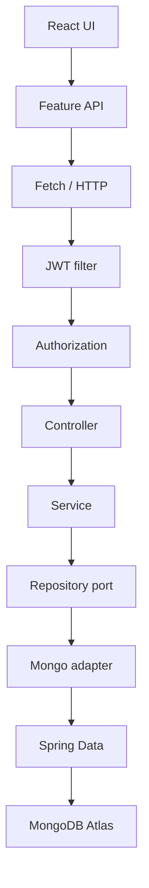

# Trainer requirements

This page maps the classroom checklist to the code that is already in the canonical React branch. Advanced behavior (five roles, ownership, dashboards, i18n, Docker) stays. The rows below are the literal items a reviewer can point at on screen.

## Screen-share path



The browser calls a relative `/api` URL. `JwtAuthenticationFilter` validates the Bearer token before the controller runs. `@PreAuthorize` and `BankAuthorizationService` decide the role and the object owner. The controller does not talk to MongoDB.

## Requirement map

| Trainer requirement | Implementation | File / endpoint | How to demonstrate | Status |
| --- | --- | --- | --- | --- |
| REST architecture | Controller, service, repository port, Mongo adapter, Spring Data | `UserController`, `UserServiceImpl`, `UserRepository`, `MongoUserRepositoryAdapter` | Open those four files, then call one endpoint in Postman | Done |
| MongoDB Atlas | Spring Data documents and Decimal128 money | `application` config via `MONGODB_URI` | Atlas collections `users`, `accounts`, `transactions` | Done |
| Git history | Phase branches kept; canonical branch fast-forwards | `ReactFrontend-BankApp-Making-RestCall-To-Backend` | `git log --oneline` | Done |
| Postman | Current RBAC collection plus a blank local environment | `postman/SimpleBank_Backend_API.postman_collection.json` | Trainer JWT Authorization Demo folder | Done |
| React welcome page | Public landing at `/` | `LandingPage.tsx` | Open the site signed out | Done |
| Header component | Child of the landing page | `PublicHeader.tsx` | Brand, nav, language, Sign in / Open app | Done |
| Footer component | Child of the landing page | `PublicFooter.tsx` | Educational disclosure | Done |
| Nested components | Header owns the language switcher and mobile menu | See nesting below | Show the file tree in the IDE | Done |
| Props down | Parent passes `isAuthenticated` | `LandingPage` → `PublicHeader` | Toggle login and watch the header link | Done |
| Callbacks up | Child calls `onConfirm` | `ConfirmDialog` | Delete a customer and confirm | Done |
| Fetch / feature API | One shared `request()` plus feature clients | `usersApi`, `accountsApi`, `authApi`, `meApi` | Network tab on the customer list | Done |
| Loading | Skeleton, not a downgraded spinner | `PageLoading` | Throttle the network and open Customers | Done |
| Error | API failure becomes a retryable message | `ApiError` → `getErrorMessage` → `ErrorState` | Call a forbidden action while signed in as a customer | Done |
| Empty list | HTTP 200 and `[]` renders `EmptyState` | Search with no match; customer with no accounts | Postman, then the empty table state | Done |
| Customer CRUD | Create, list, get, update, delete | `POST/GET /api/users`, `GET/PUT/DELETE /api/users/{id}` | Customer CRUD Demo folder with an admin token | Done |
| Search | Case-insensitive name prefix | `GET /api/users/search?firstName=` | `josvier` matches `Josvier Rodriguez` | Done |
| Filter | Premium accounts already existed | `GET /api/accounts/premium?threshold=` | Accounts CRUD folder | Done |
| Customer → accounts | Staff lookup vs the customer's own portal | `GET /api/users/{id}/accounts` and `GET /api/me/accounts` | Customer details, then sign in as that customer | Done |
| JWT | Register, login, signed token, expiry, roles, Bearer, stateless security | `AuthServiceImpl`, `JwtService`, `JwtAuthenticationFilter` | Trainer JWT folder | Done |
| Customer vs admin token | Same token service, different authorities | `customerToken` / `adminToken` | Customer `/admin/whoami` is 403; admin is 200 | Done |
| BCrypt | Passwords are hashed, never stored or returned | `BCryptPasswordEncoder` in registration | Show a hash in Atlas and the absent password field in JSON | Done |
| Reserved username | Only an administrator identity may be named `admin` | `AuthIdentityPolicy` | Register `admin` → 409 `RESERVED_USERNAME` | Done |
| CORS | Same-origin `/api` through Vite or Nginx | `frontend/vite.config.ts`, `frontend/nginx.conf` | Network tab shows `/api`, not a second origin | Done |

## Component nesting

`LandingPage` is the parent. `PublicHeader` and `PublicFooter` are children. The header owns its own mobile-menu state and renders `LanguageSwitcher`.

```text
LandingPage
├── PublicHeader
│   ├── LanguageSwitcher
│   └── Mobile navigation
├── Product sections
└── PublicFooter
    └── LanguageSwitcher
```

The signed-in application shell is a different parent:

```text
AppShell
├── Navigation
├── LanguageSwitcher
├── User block
└── Outlet
```

A staff customer screen composes shared children:

```text
CustomersPage
├── PageHeader
├── DataTable
├── RowActions
├── Dialog
└── ConfirmDialog
```

Parent means the component that renders another component. Child means the component that was rendered. Nested means a child that itself renders another component, such as `PublicHeader` rendering `LanguageSwitcher`.

## Props down

React passes data from parent to child through props.

```text
LandingPage
   │
   └─ isAuthenticated
          ↓
      PublicHeader
```

```text
LandingPage
   │
   ├─ credentialsUrl
   └─ repositoryUrl
          ↓
      PublicFooter
```

```text
CustomersPage
   │
   ├─ columns
   ├─ data
   └─ getRowId
          ↓
       DataTable
```

## Callbacks up

Events travel from child to parent through functions the parent passed in.

```text
ConfirmDialog
   │
   └─ onConfirm()
          ↑
        Parent
```

The same direction is used by `onCancel`, `onRetry` on `ErrorState`, `onOpenChange` on dialogs, and row selection callbacks. The child does not reach into the parent's state. It calls the function it was given.

## Fetch layer

There is no single `DataService` class. Each feature owns a small client, and every client uses the same `request<T>()` helper, which calls `fetch()`.

```text
Component
   ↓
feature API  (usersApi, accountsApi, authApi, meApi, adminApi, dashboardApi)
   ↓
shared request<T>()
   ↓
fetch()
   ↓
REST API
```

One transport plus feature clients stays smaller than one class that knows every endpoint. Adding transfers or dashboards did not require editing a shared data god-object.

## Loading, error, and empty list

| Situation | HTTP | UI |
| --- | --- | --- |
| Request still running | — | `PageLoading` skeleton |
| Failure the user can see | 4xx / 5xx | `ErrorState` and Retry. No stack trace |
| Successful list with nothing in it | 200 `[]` | `EmptyState` |

An empty list is a successful answer. Examples: `GET /api/users/search?firstName=zzzz-no-match`, a customer who has no accounts, and an account whose transaction history is empty.

## Customer and accounts

Staff lookup:

`GET /api/users/{id}/accounts`

The teller, manager, auditor, or admin asks for a customer by id. The customer details page renders those accounts.

Customer portal:

`GET /api/me/accounts`

The signed-in customer does not choose another person's id. The service uses the bank customer linked to that login. A customer who asks for someone else's account by id receives 404, so the response does not confirm that the other account exists.

## JWT, not two token classes

`CustomerToken` and `AdminToken` in the classroom are two logins, not two Java types. `JwtService` signs both. The customer token carries `ROLE_CUSTOMER`. The admin token carries `ROLE_ADMIN`. The filter and the role checks do the rest.

Public registration cannot create username `admin`, `Admin`, `ADMIN`, or ` admin `. Those all normalize to `admin`. If an auth user with that username exists, changing it to any role other than ADMIN returns 409 `RESERVED_USERNAME`. Names such as `ava.admin` are ordinary usernames. The application does not ship a built-in `admin` / `admin` password.

## CORS

The React app and the API share one origin from the browser's point of view.

Development: the page is served by Vite, and `/api` is proxied to Spring Boot on port 8080.

Docker: the page is served by Nginx on port 3000, and Nginx proxies `/api` to the backend container.

The project does not use `@CrossOrigin("*")`.

## Basic Auth, JWT, and OAuth

| Approach | In this project |
| --- | --- |
| Basic Auth | Conceptual only. The browser would resend the password on requests. That is a poor fit for this SPA. |
| JWT | Implemented. The server signs a stateless access token after login. The password is not sent again. |
| OAuth 2.0 / OIDC | Conceptual only. An identity provider would authenticate the user and issue tokens. That is outside this course scope. |
