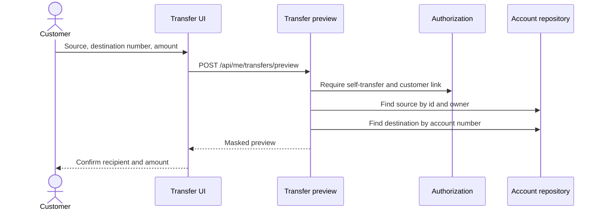
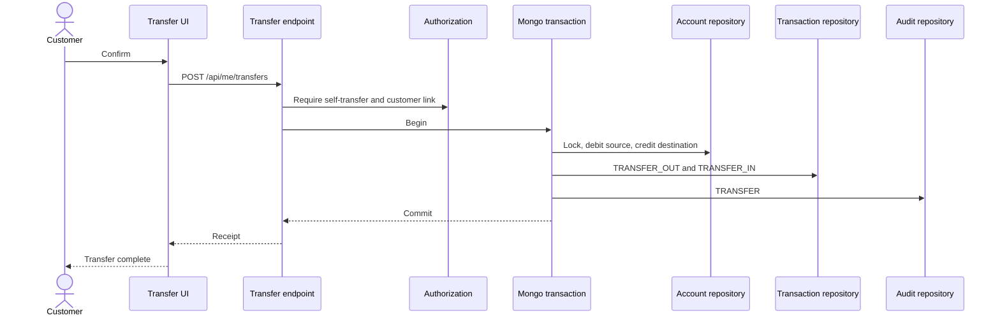

# Internal transfer flow

Simple Bank supports internal transfers only. A customer can move money from an account they own to another account in the same bank. The destination may be another of their accounts or another customer's account. External banks, ACH, wires, saved beneficiaries, schedules, fees, and approvals are out of scope.

## Why this stays safe

Ownership still means the customer can read only their own profile, accounts, and movements. They cannot open another customer's account page or history.

Sending money is a separate command. It is allowed only when:

- the actor's role includes self-transfer
- the source account belongs to the authenticated customer's bank user
- the destination account number exists and is active
- the source and destination are different accounts
- the source balance covers the amount

The preview response confirms the destination with a limited name and a masked account number. It does not return the destination account id, balance, or history. There is no general lookup API for account numbers.

## Account numbers

Each account receives a 12-digit public `accountNumber` when it is created. The value is not the MongoDB id. A unique sparse index enforces uniqueness. Creation retries if two generators collide.

Demo accounts use deterministic numbers `100000000001` through `100000000021`.

The owner sees the full number of each account they own, including in the source selector. A destination that belongs to someone else is shown back as `••••` plus the last four digits, with a short name such as `Ethan P.` A full foreign account number is not displayed.

## Privacy choice

The preview and receipt show the recipient as first name plus last initial, for example `Sofia R.`, together with the masked number. The customer already typed the public number. The short name confirms they reached a real account without publishing the full legal name or an internal id.

## Preview

`POST /api/me/transfers/preview`

```json
{
  "sourceAccountId": "owned-account-id",
  "destinationAccountNumber": "100000000021",
  "amount": 25.0
}
```

The response includes masked source and destination numbers, the limited destination name, the amount, the source balance, and whether the destination is owned by the same customer.



## Execution

`POST /api/me/transfers` uses the same request body. The server derives the actor from the token. The client does not send a role.

On success the service, inside one Mongo transaction:

1. validates the source, destination, and amount again
2. debits the source and credits the destination
3. writes `TRANSFER_OUT` on the source and `TRANSFER_IN` on the destination
4. stores a transfer reference, masked counterparty number, and limited counterparty name
5. writes one banking audit with action `TRANSFER`, the initiating customer, both account ids, and the amount
6. returns a receipt with the reference, masked accounts, recipient, new source balance, and time



If any write fails, the transaction rolls back. No balance, history row, or audit is kept.

## Validation

| Condition | Result |
| --- | --- |
| Role cannot transfer | 403 Access is denied |
| Source is not owned by the actor | 404 Resource not found |
| Destination number does not exist | 404 Destination account was not found |
| Source and destination are the same account | 400 Cannot transfer to the same account |
| Amount exceeds the source balance | 400 Insufficient funds |
| Amount is below 0.01 or not a 12-digit number | 400 validation error |

A successful transfer does not make `GET /api/me/accounts/{foreignId}`, `GET /api/accounts/{foreignId}`, or `GET /api/users/{foreignUser}/accounts` succeed for the sender.

## What changes after success

The sender's history shows transfer out, the recipient name, and the masked destination. The recipient's history shows transfer in from the sender. The customer dashboard counts transfers in and transfers out separately from deposits and withdrawals. Manager transfer volume includes the movement because the banking audit action is `TRANSFER`. Auditor recent audits include that row. Tellers still have no transfer action.

The demo seed still creates 78 transactions and 60 banking audits. After that seed is marked complete, a later internal transfer adds rows. The next demo startup checks that those counts are at least the seed baseline and that every balance still reconciles. Identity counts stay fixed.

Staff transfers that use internal account ids on `POST /api/accounts/transfer` remain a separate manager and administrator command. They still cannot be used by a customer to read a foreign account.
